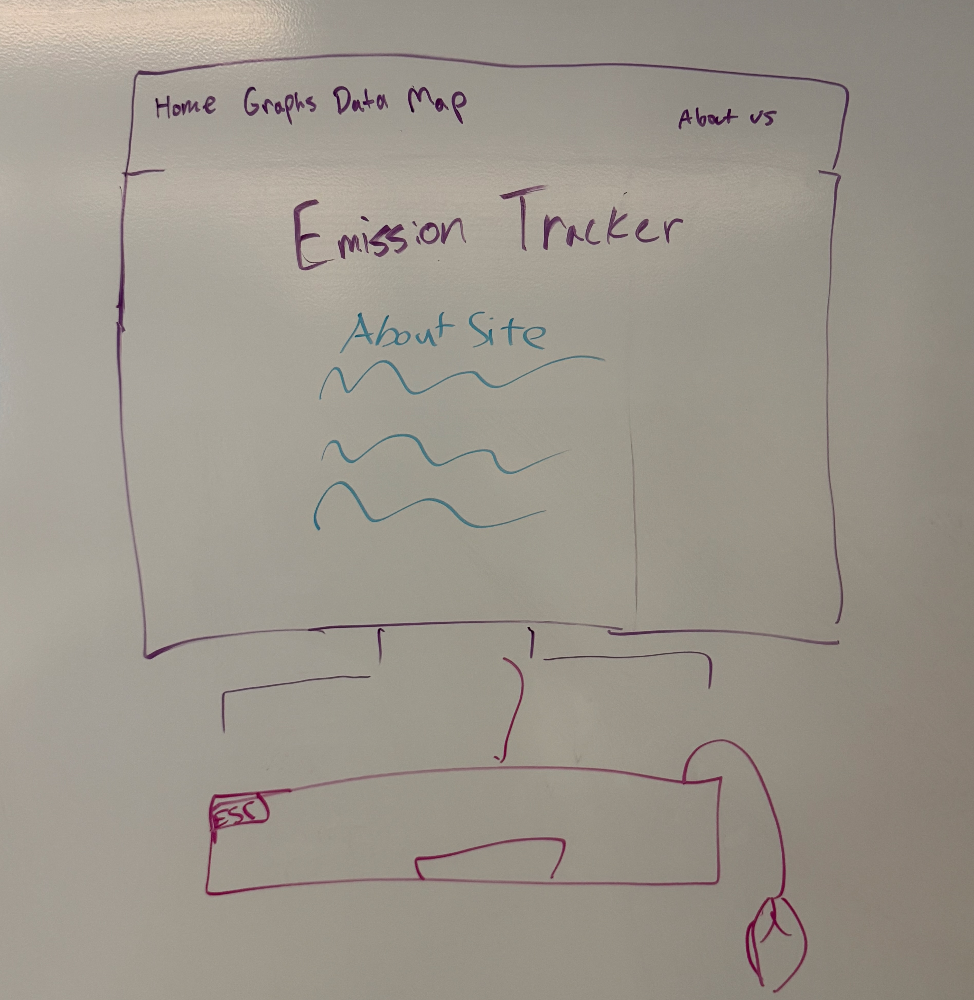
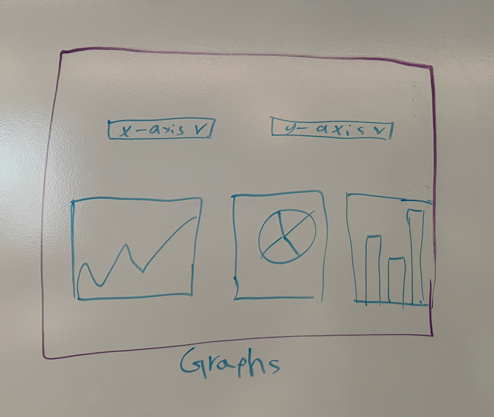
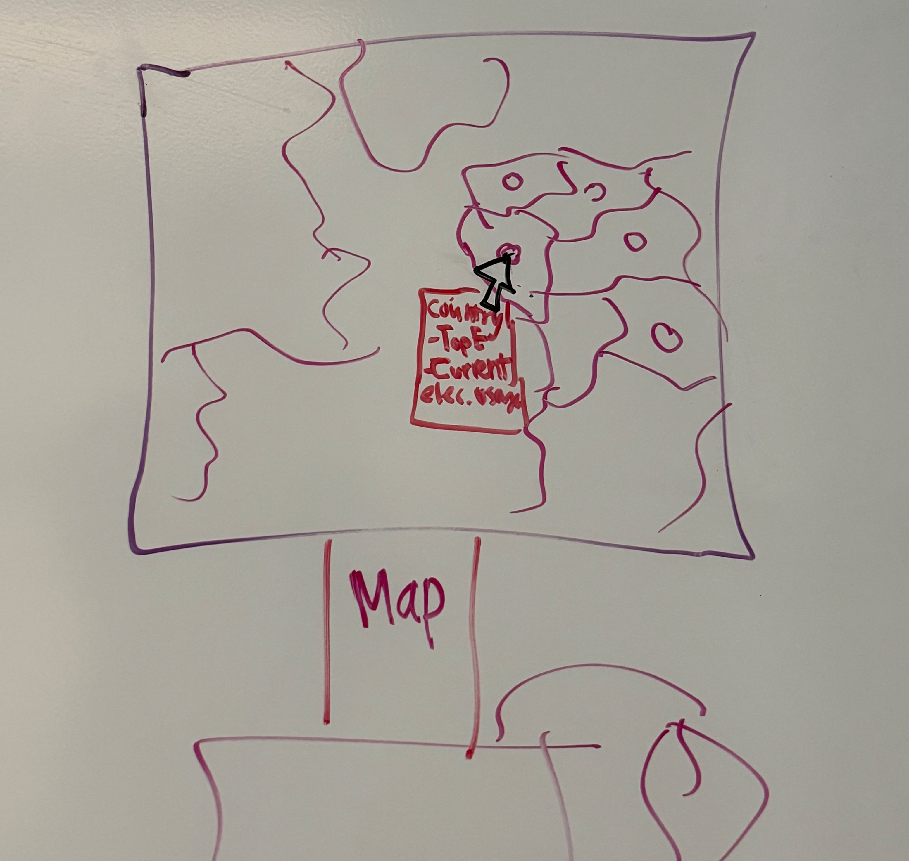
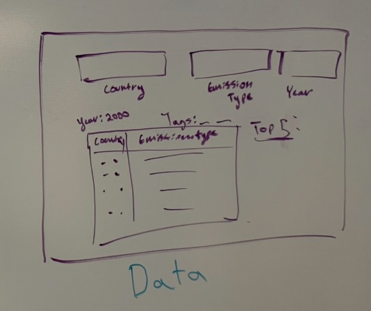

# Title
Emission Tracker
# Sustainable Development Goal(s)
Our group plans to focus our project on SDG 13, Climate Action. Possible contributions that our project could offer would be sharing information regarding Climate Action, such as tracking various types of emissions based on country.

# Features

## Feature 1:  
Look up top biofuel consumption information about a specific country 

* Person responsible: Beyonce 
* User story: As a user interested in climate change, I can look up individual countries' top biofuel consumption information so that I can form a more comprehensive view of biofuel usage across the world.
* Acceptance Criteria: Given that I (the user) pick Australia, I will receive an output of 190.864 (measured in terawatt-hours).

## Feature 2: 
Look up information about the ratio of average co2 per capita data to the average energy consumption per capita data of a country

* Person responsible:Bradley
* User story: As a user interested in climate change, I can find the ratio of co2 per capita to energy consumption per capita of a country to know how much a country emits co2 compared to how much energy it uses on average.
* Acceptance Criteria: Given that Canada is chosen, then we get a float value equal to the average of co2_per_capita.

## Feature 3:  
Look up CO2 emissions of all countries for a specific year

* Person responsible: Rimona
* User story: As a user interested in climate change, I can compare CO2 emissions between each country in the dataset in a specific year so that I can learn more about how they compare to each other.
* Acceptance Criteria: Given that the user chooses the year 2008, then they will get an output of lists with the country, year, and emissions for every row from 2008, such as |Canada, 2008, 1.672|, |Japan, 2008, 1.334|, and |Argentina, 2008, 1.029|.

# Datasets Metadata
Energy Dataset:
URL: https://github.com/owid/energy-data.git
Date downloaded: 1/14/2026
Authorship: Pablo Rosado, Hannah Ritchie, Edouard Mathieu, and Max Roser.
Exact name and version: Data on Energy by Our World in Data
Terms of use: Creative Commons BY License
Suggested citation: Hannah Ritchie, Pablo Rosado, and Max Roser (2023) - “Energy” Published online at OurWorldinData.org. Retrieved from: 'https://ourworldindata.org/energy' [Online Resource]

CO2 Dataset:
URL: https://github.com/owid/co2-data  
Date downloaded: 1/14/2026
Authorship: Pablo Rosado, Hannah Ritchie, Max Roser, Edouard Mathieu, and Bobbie Macdonald
Exact name and version: CO2 and Greenhouse Gas Emissions by Our World in Data
Terms of use: Creative Commons BY License 
Suggested citation: Hannah Ritchie, Pablo Rosado, and Max Roser (2023) - “CO₂ and Greenhouse Gas Emissions” Published online at OurWorldinData.org. Retrieved from: 'https://ourworldindata.org/co2-and-greenhouse-gas-emissions' [Online Resource]

# Mock up

# Data story

Bradley found the CO2 emissions and Beyonce found the Electricity emissions. 

We are excited about this project because we aim to share a clear depiction of how climate change has progressed over the years, along with understanding how energy consumption has developed along with it.

